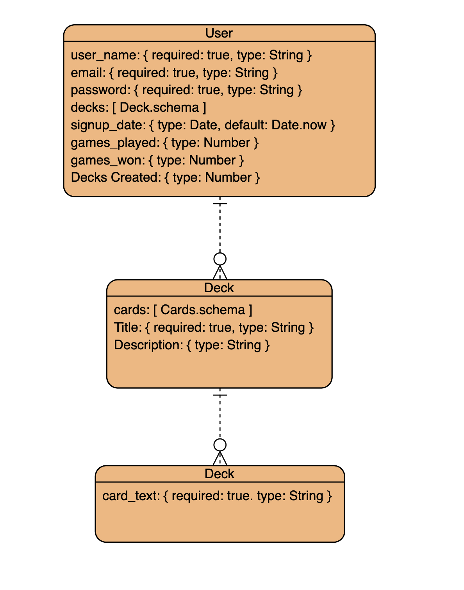
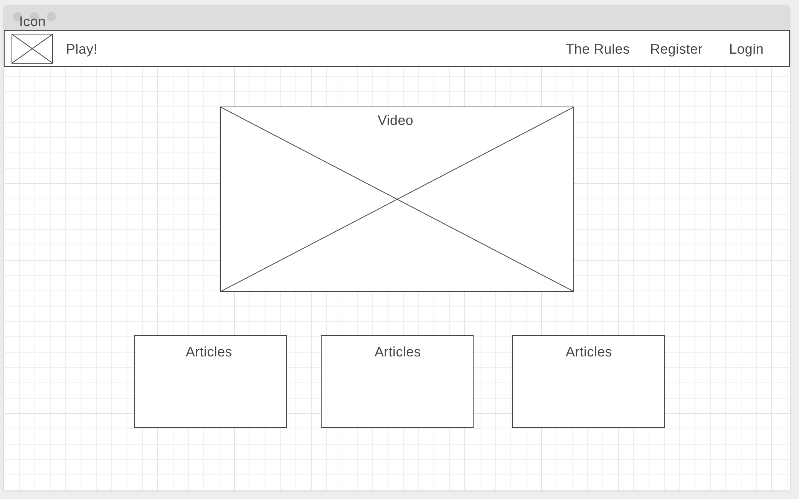
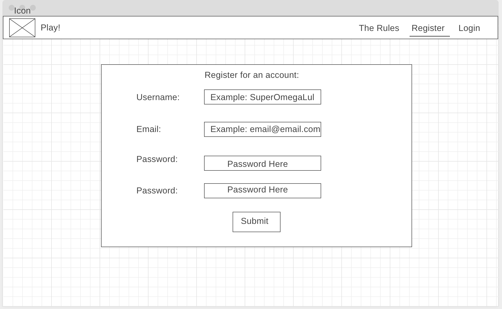
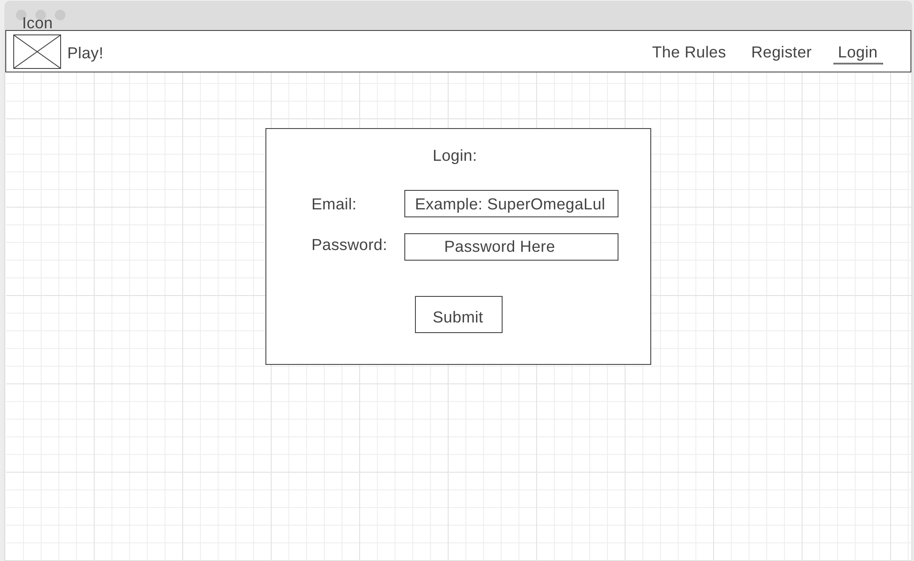
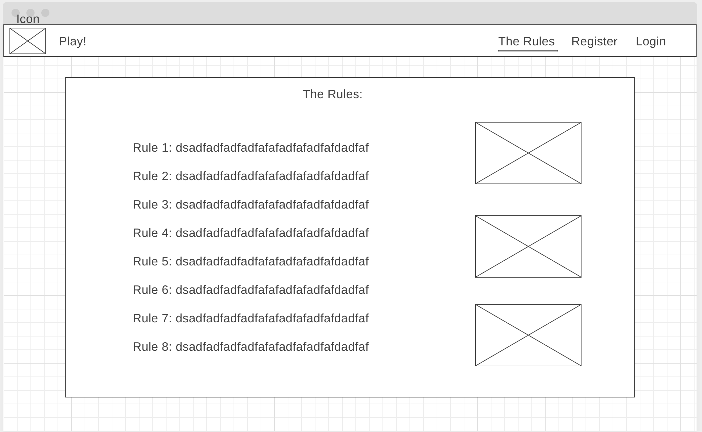
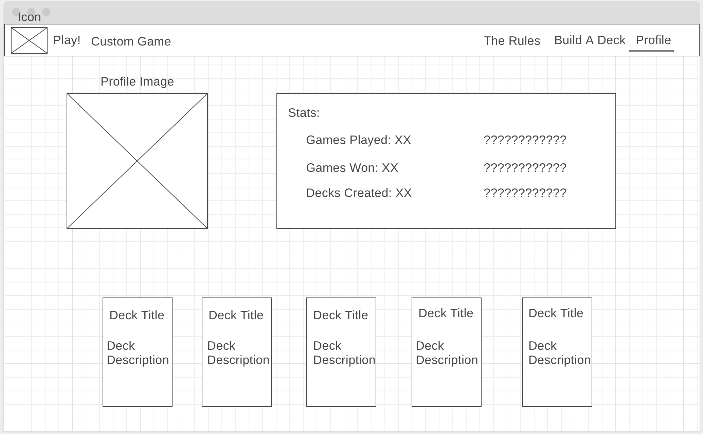
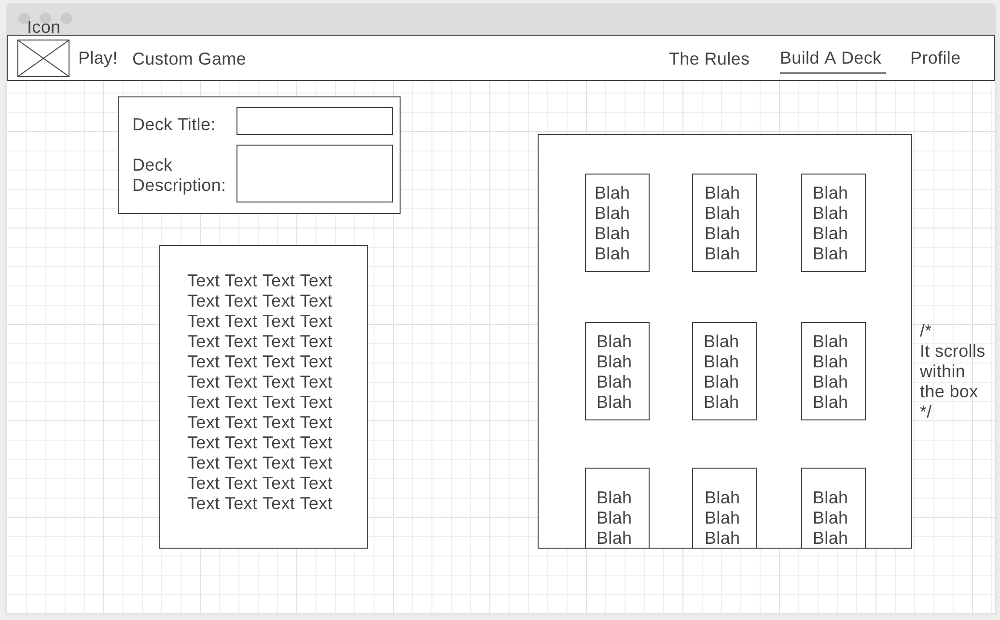
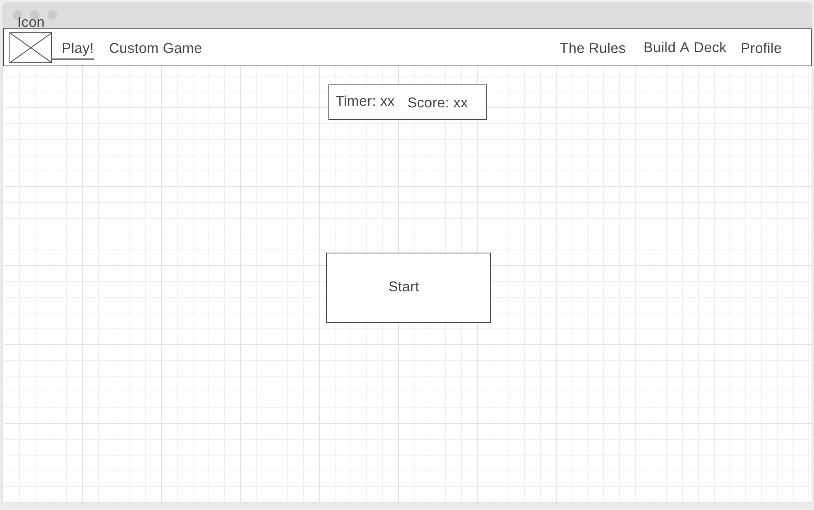
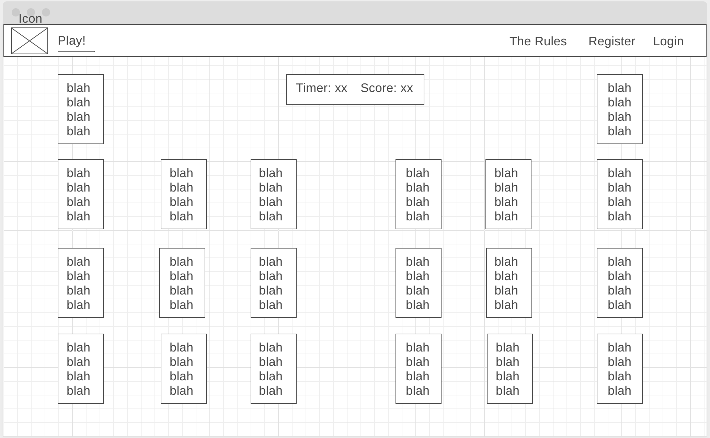

# Karuta Server

## React Repo
[https://github.com/Jrlyons96/karuta_react](https://github.com/Jrlyons96/karuta_react)

## Trello
[https://trello.com/b/5EEZa9vd/capstone](https://trello.com/b/5EEZa9vd/capstone)

## Technologies Used
- Full M.E.R.N. Stack
- MongoDB & Mongoose: database
- Node: Server enviornment
- Express: Server Framework
- React: Frontend 'framework'
- Semantic UI
- Github / Git
- Heroku

## Wireframes










## Things to do
- Add Redux to clean out the statem management
- Make the site response to alternative screen ratios. I didn't do it from the start because I don't really like mobile games and apps that require the user to play horizontally.

## Biggest Wins
- Doing everything I possibly could using recursion

## Code snippits I'm proud of

```javascript

How I made buttons show forms & cards disappear when clicked {basically a modal}

    state = {
        user: [],
        edit_username: "",
        edit_email: "",
        edit_profile_image: "",
        profile_edit_display: "none",
    }

    showProfileEditButton = () => {
        this.state.profile_edit_display === "none" ?
        this.setState({ profile_edit_display: '' }) :
        this.setState({ profile_edit_display:'none' })
    };

    style={{ visibility: card.visibility }}>
```

```javascript

My count down timer

    timer = () => {
        if (this.state.narrator_deck[0].card_text === "Lets play a game...") {
            return;
        };
        let newTimer = [...this.state.timer];
        if (newTimer.length === 0 ) {
            newTimer = [5,4,3,2,1];
            this.setState({ timer: newTimer});
        };
        setTimeout(() => {
            if (newTimer.length > 0) {
                newTimer.shift();
                this.setState({timer: newTimer});
                this.timer();
            };
        }, 1000);
    };
```

```javascript

My game login

    clickedCard = (card) => {
        let score = this.state.score;
        if (card._id === this.state.narrator_deck[0]._id ) {
            score = score + 1;
            this.setState({ 
                score: score,
            });
            card.visibility = "hidden"
        };
    };

    playGame = (narrator_deck) => {
        this.setState({
            narrator_deck: narrator_deck
        });
        setTimeout(() => {
            if (narrator_deck.length === 1 ) {
                this.setState({narrator_deck: [{card_text: "Lets play a game..."}] })
                return;
            } else if (0 < narrator_deck.length) {
                narrator_deck.shift();
                this.playGame(narrator_deck)
            };
        }, 5000);
    };
```

```javascript

Starting a game

    max18cards = (deck) => {
        if (deck.length > 18) {
            deck.pop();
            this.max18cards(deck);
        };
        return deck;
    }

    handleGameStart = () => {
        const deck_id = this.state.deck_id;
        this.setState({ score: 0})
        axios.get(`${API_URL}/deck/${deck_id}/card`, { withCredentials: true })
            .then((res) => {
                this.setState({
                    cards: res.data.data
                });
                const narrator = this.shuffleDeck([...this.state.cards]);
                if (narrator.length > 18) {
                    this.max18cards(narrator);
                };
                this.setState({ narrator_deck: narrator });
                const shuffled_deck = this.shuffleDeck([...narrator]);
                this.setState({
                    narrator_deck: narrator,
                    shuffled_deck: shuffled_deck
                });
                this.playGame(narrator);
                this.timer();
            })
            .catch((err) => console.log(err.response))
    };
```


## Shout-outs
- Kenny, Dalton, and Matt. I could not have finished this project without them!!!
- George Strait and Johnny Cash for keeping me sane when I sat in my living room for 8 hours straight coding over the weekend (haha...)
